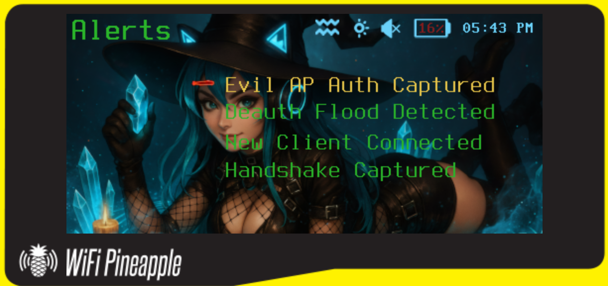
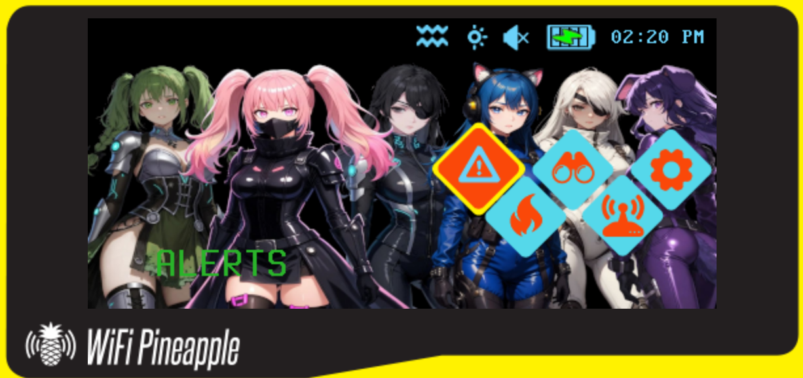
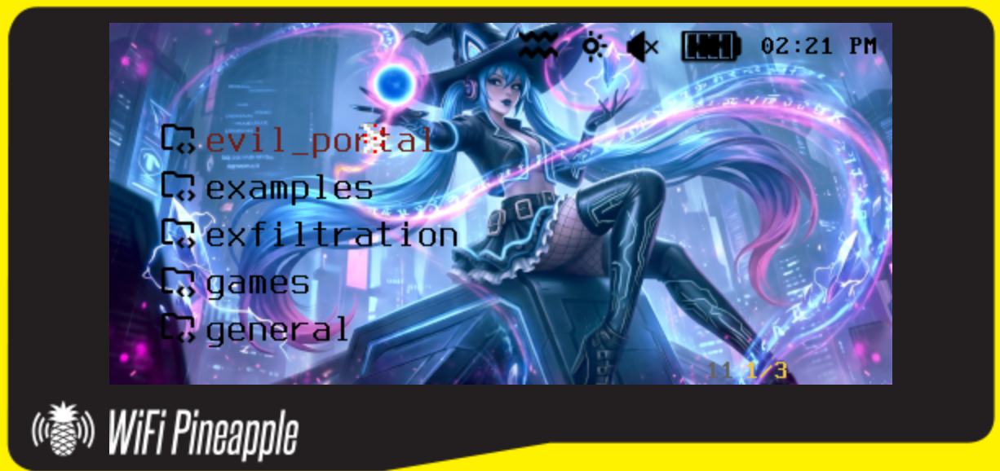
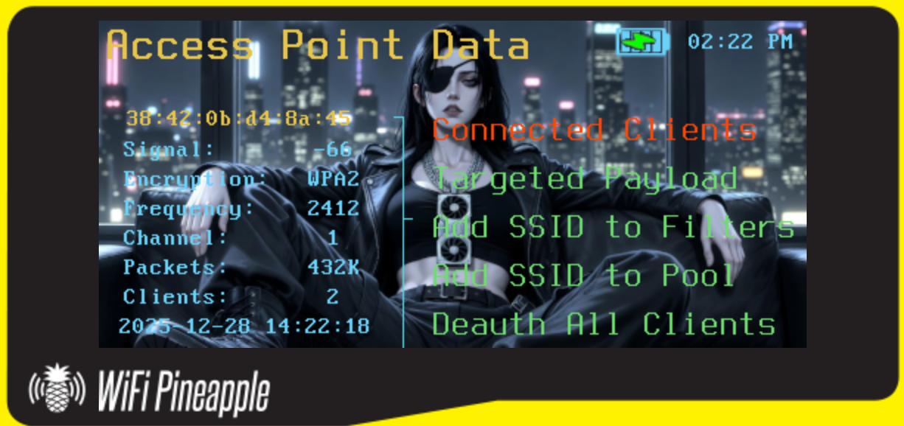
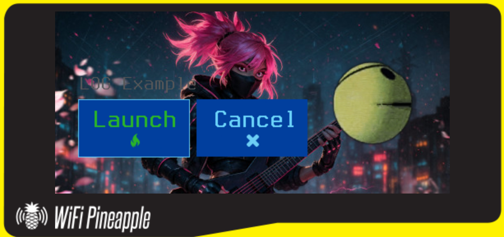
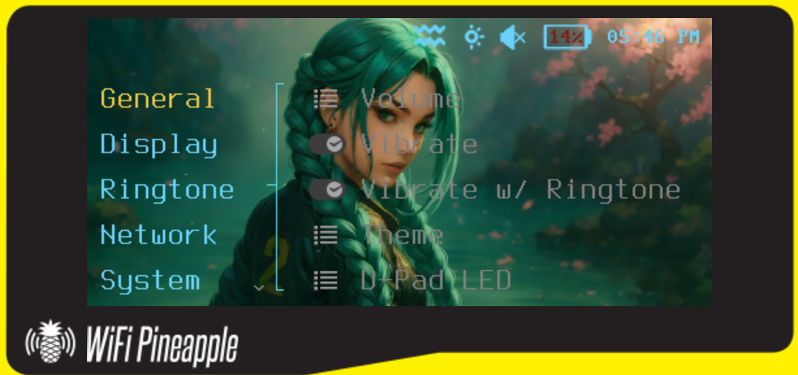
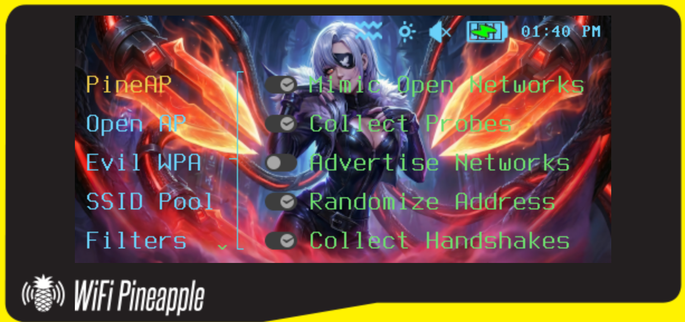

# UwU Underground Pager Theme

Custom theme for WiFi Pineapple Pager ([Hak5 Repo](https://github.com/hak5/wifipineapplepager-themes))    
    
*There's still a lot to do, tackling the font colors in each dashboard is next:   
      
-Give proper credit for art (@_winter_wonders and @uwu_underground)    
-Convert song melodies to ringtones?    
-Change icons and other images    
-Change Recon and pop backgrounds    
-Change Payload Dashboard status bar battery icon

*Some AI Slop has been used to help generate this README

---


## Quick Theme Structure Overview

```
uwu_underground/
├── theme.json              # Main theme configuration (maps components)
├── assets/                 # Images, icons, backgrounds
│   ├── dashboard/          # Dashboard backgrounds and icons
│   ├── statusbar/          # Status bar icons
│   ├── toggle/             # Toggle switch graphics
│   ├── radio/              # Radio button graphics
│   ├── optiondialog/       # Option dialog backgrounds
│   └── [other folders]     # Various UI element graphics
└── components/             # UI component definitions (JSON files)
    ├── dashboards/         # Main menu screens
    ├── status_bars/        # Status bar configurations
    ├── dialogs/            # Dialog boxes and popups
    ├── templates/          # Reusable UI element templates
    ├── settings/           # Settings menu screens
    ├── recon/              # Recon menu screens
    ├── pineap/             # PineAP menu screens
    ├── alerts/             # Alert/notification screens
    └── keyboards/          # On-screen keyboard layouts

```

## Change Log / Modifications

**Files Modified:**   
*Note: Full size backgrounds should be 480 x 222 pixels

- `assets/alerts_dashboard/alerts_bg.png` - Yuma (Art provided by @_winter_wonders)    
<br>
<br>
- `assets/dashboard/main_dashboard.png` - UwU group     
    
<br>
- `assets/payloads_dashboard/payloads_bg.png` - Yuma (Art provided by @_winter_wonders)    
    
<br>
- `assets/blank_recon_bg.png` - Yin with GPU (This is for both the AP and Client recon payload dashboards)    
  
<br>
- `assets/launch_payload_dialog/launch_payload_bg.png` - Yuki 
 
<br>
- `assets/settings_bg.png` - Yulia (Art provided by @_winter_wonders)    
    
<br>
- `assets/yang.png` - Yang (Art provided by @_winter_wonders)    
<br>
<br>
- `components/dashboards/dashboard_settings.json` - Updated font colors to the following:    
```
Menu Items: blue
Sub-menu Items: light_yellow
Menu Selected Item: orange
```
- `components/dashboards/dashboard_payloads.json` - Updated font colors and status bar to the following:    
```
Menu Items: black
Menu Folder Icon: black
Selected Item: dark_red
Status Bar: payloads (status_bar_payloads.json)
```
- `components/dashboards/dashboard_pineap.json` - Updated font colors to the following:    
```
Menu Items: blue
Sub-menu Items: light_green
Selected Item: yellow
```

- `theme.json` - Added the following components:    
```
# New status bar for payload dashboard
"payloads": "components/status_bars/status_bar_payloads.json"
```